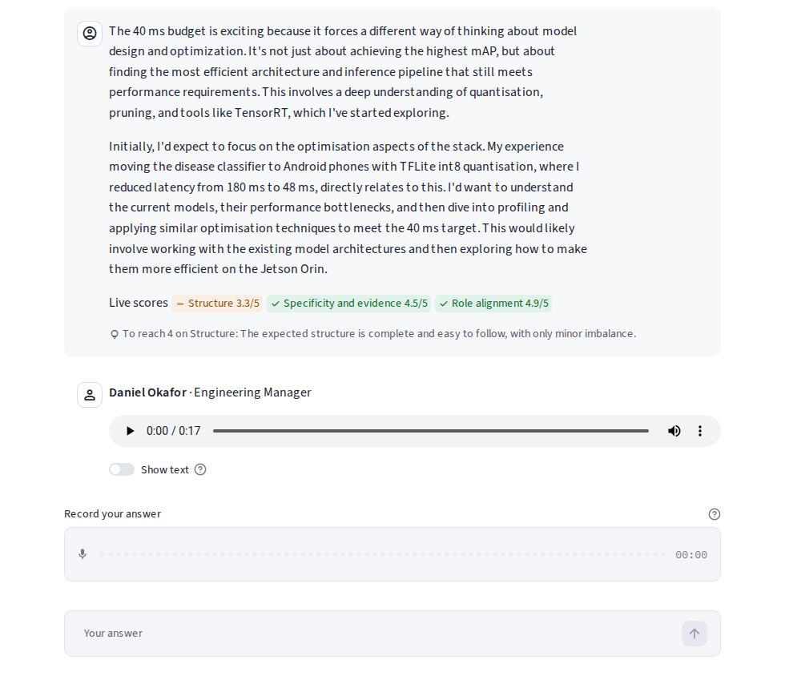
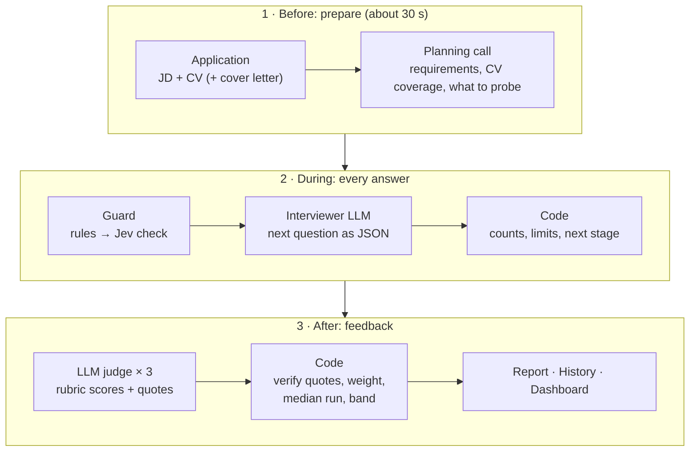
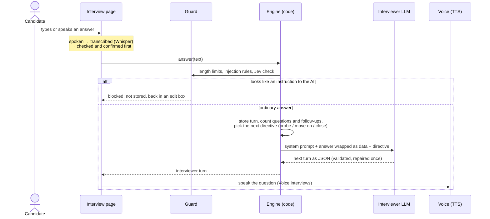
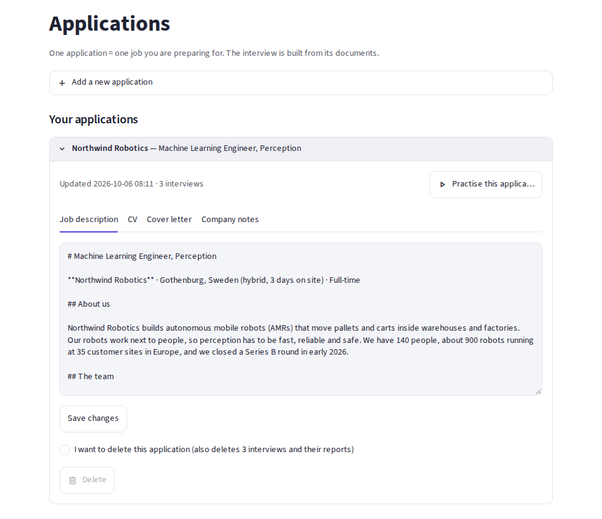
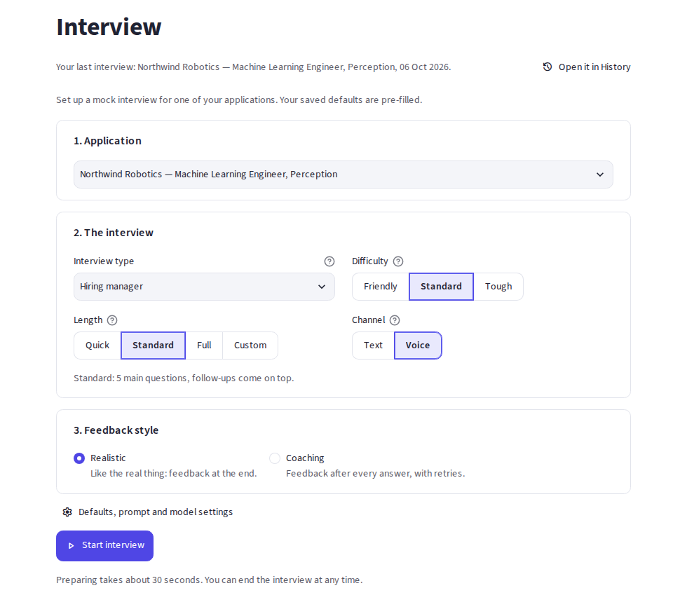
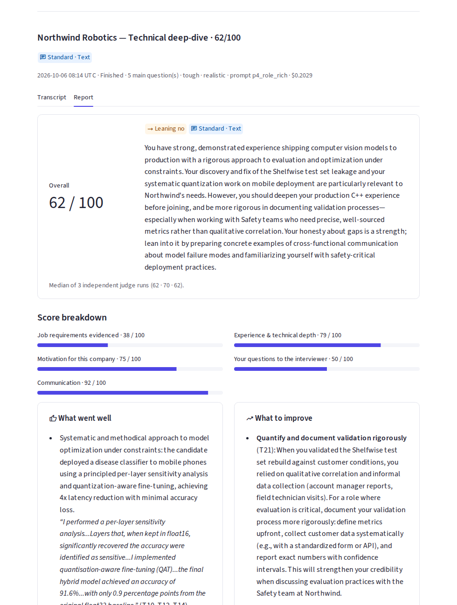
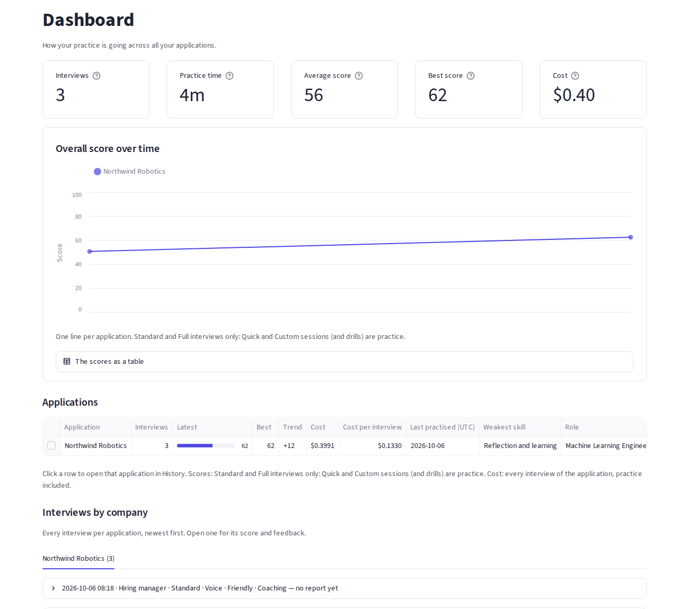
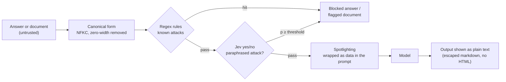

# Interview Helper

**Mock job interviews tailored to one real application.** Upload the job description and your CV; an LLM interviewer reads both and runs a realistic, multi-turn interview, probing vague answers and the gaps between the job and your CV. At the end, an LLM judge scores the transcript against a rubric and writes feedback that quotes what you actually said.

Turing College AE · Sprint 1 capstone · Streamlit + OpenRouter · runs locally

<p align="center"></p>
<p align="center"><sub>A Voice interview in Coaching mode (fictional sample candidate): live rubric scores after each answer, the next question spoken aloud, and the mic for a spoken reply.</sub></p>

## The core idea in 30 seconds

- **Grounded, not generic.** A planning call turns the JD and CV into a plan (the job's requirements, how well the CV covers each, what to probe), and the interviewer works through it like a real hiring manager would.
- **The model judges, code computes.** Models decide what to ask and how good an answer is. Code counts questions and follow-ups, enforces limits and budgets, weights the rubric and decides the result band. No number in a report comes from a model's arithmetic.
- **Untrusted text never becomes an instruction.** Every answer and document passes a guard (regex rules + a decision-model check) and is wrapped as data before any prompt sees it.



## For reviewers: requirements → where to look

| Requirement | Where it is met | Evidence |
|---|---|---|
| R1 Interview-prep app | Application-specific mock interviews with a rubric report | [User guide](docs/07-user-guide.md) |
| R2 Front end | Streamlit, multi-page | [`app/`](app/) |
| R3 Allowed model | Interviewer `openai/gpt-5-mini` (default, switchable in Settings) | [`config.py`](src/interview_app/config.py) |
| R4 Five system prompts, compared | Zero-shot, few-shot, chain-of-thought, role-rich + plan, self-critique | [`prompts/`](src/interview_app/prompts/) · [comparison](docs/05-prompt-comparison.md) |
| R5 Security guard | Rules + Jev injection check, spotlighting, limits, safe output | [`security/`](src/interview_app/security/) · [Security](#security) |
| E3 More security constraints | Input validation, LLM-based injection check, document flags | [`injection.py`](src/interview_app/security/injection.py) |
| E4 / E7 Difficulty, personas | Interview type × difficulty → interviewer persona | [`persona.py`](src/interview_app/interview/persona.py) |
| E8 Tune a setting | `reasoning_effort` sweep | [`lab/sweep_setting.py`](lab/sweep_setting.py) |
| M1 / M7 Model settings and choice in the UI | Settings → developer settings (model, temperature, max tokens, effort, judge) | [`settings.py`](app/views/settings.py) |
| M2 Two+ JSON formats | `InterviewPlan`, `InterviewerTurn` (3 variants), `Judgement` / `Report` | [`schemas.py`](src/interview_app/interview/schemas.py) |
| M3 Prompt price | Cost per interview, per company, over time and by purpose | Dashboard · [`cost.py`](src/interview_app/cost.py) |
| M6 Job description field | The whole app is built around the JD | [`ingest.py`](src/interview_app/ingest.py) |
| M9 Guard + developer settings separated | Developer settings behind a toggle | [`settings.py`](app/views/settings.py) |
| H1 Full chatbot | Persistent multi-turn sessions, resumable | [`engine.py`](src/interview_app/interview/engine.py) |
| H4 Open-weight models | `google/gemma-4-31b-it`, `minimax/minimax-m2.7` in the picker | [`config.py`](src/interview_app/config.py) |
| H5 LLM-as-a-judge | Candidate report and an interviewer-quality judge | [`evaluation/`](src/interview_app/evaluation/) · [`lab/`](src/interview_app/lab/) |

## How it works


`app/` is a thin Streamlit UI; `src/interview_app/` is the core and never imports Streamlit, so it is tested on its own (about 600 unit and UI tests, no network). Every model call goes through one gateway (`llm/client.py`, or `llm/decide.py` for Jev) and is logged with tokens, cost and latency, which is what the cost views are built on.

One answer, end to end:



| Layer | Modules |
|---|---|
| UI | [`app/views/`](app/views/) pages, [`report_view.py`](app/report_view.py), design system in [`app.css`](app/styles/app.css) + [`ui_common.py`](app/ui_common.py) |
| Interview | [`interview/engine.py`](src/interview_app/interview/engine.py) (turns, limits, stages), `persona.py`, `plan.py`, `prompting.py`, Jinja2 templates in [`prompts/`](src/interview_app/prompts/) |
| Evaluation | [`evaluation/`](src/interview_app/evaluation/): exchanges and metrics (code) → judge (LLM) → aggregation (code); [`rubric.json`](docs/rubric.json) is the single source of rubric items and weights |
| Security | [`security/`](src/interview_app/security/): limits, injection rules + Jev, spotlighting |
| Progress and cost | `history.py`, `dashboard.py`, `cost.py`: computed from stored rows, no model calls |
| Gateway | [`llm/client.py`](src/interview_app/llm/client.py) (chat, TTS, STT), [`llm/decide.py`](src/interview_app/llm/decide.py) (Jev), `llm/pricing.py` |

## A tour of the app

| | |
|---|---|
|  **Applications**: upload or paste a JD and CV, or load the fictional sample. |  **Start**: interview type, difficulty, length (Quick / Standard / Full), Text or Voice, realistic or coaching. |
|  **Report**: overall score, hiring signal, quoted strengths, what to improve, a stronger version of the weakest answer. |  **Dashboard**: progress and cost across companies, every interview with its feedback. |

Voice interviews speak each question (Gemini TTS) and accept spoken answers (Whisper), which you check before sending. The page-by-page detail is in the [user guide](docs/07-user-guide.md).

## Prompt engineering

**Message roles.** `system` carries the persona, rules, the documents (wrapped as data) and the output format; `user` carries the candidate's answers in `<candidate_answer>` tags after the guard; `assistant` carries the interviewer's earlier turns; a short final `system` message carries what code computed (questions asked, follow-ups used, what to do next), last so the long prompt above stays cacheable.

**Five interviewer prompts (R4).** Each is the zero-shot baseline plus exactly one technique, so a comparison shows what each adds:

| Variant | Technique | What it adds | Realism (1–5) | $ / session |
|---|---|---|---|---|
| P1 | Zero-shot | Instructions only | 3.69 | 0.009 |
| P2 | Few-shot | Worked turns from a *different* fictional interview | 4.06 | 0.010 |
| P3 | Chain-of-thought | A private `notes` field written before the message | 3.96 | 0.015 |
| **P4** | **Role-rich + prompt chaining** | **Detailed persona, the interviewer guideline, a separate planning call** | **4.07** | 0.016 |
| P5 | Self-critique | `draft` → `critique` → final message in one turn | 4.02 | 0.016 |


Measured with [`lab/compare_prompts.py`](lab/compare_prompts.py): a simulated candidate (Gemini, playing strong, weak and evasive personas) and Jev judging each transcript. P4 is the default: it follows the full guideline and a plan of the job's requirements, so coverage is traceable. Zero-shot scored lowest; P2, P4 and P5 are within noise of each other with one session per persona. Details and limits: [prompt comparison](docs/05-prompt-comparison.md).

**Output types.** Structured JSON (`json_schema`) for every interviewer turn, the plan and the judge, validated with pydantic and repaired once; typed probabilities from Jev (`noul`, `score`, `choice`) where code sets the thresholds; free text only inside JSON fields.

**Model settings.** `temperature` 0 for the judge (stable scores; gpt-5 models ignore it); `max_tokens` 16 000 for the judge (a reasoning model spends part of it thinking); `reasoning_effort` `low` for the interviewer (medium doubled latency for no quality gain, E8) and the planner; the judge comes from a different model family than the interviewer (self-preference bias). All of it is editable in Settings.

## Security



Mapped to the OWASP Top 10 for LLM applications: **LLM01 prompt injection** (the three layers above; model text derived from documents is wrapped too, against second-order injection), **LLM05 output handling** (everything rendered as escaped plain text), **LLM10 unbounded consumption** (limits on upload size, pages, lengths, turns, spend per interview, recording length). The judge must quote the candidate for credit, and code verifies each quote against the cited turns. The app listens on `127.0.0.1` only; the SQLite file is owner-only. In a 9-interview audit (2026-10-06) the guard blocked 6 of 6 injection attempts and none of 103 normal answers. Every rule and limit: [security in detail](docs/09-security.md).

## Quick start

```bash
uv sync
cp .env.example .env          # set OPENROUTER_API_KEY
uv run streamlit run app/main.py
```

Or as a local Docker service: `make up`, then open http://localhost:8501 (`make` lists every command; see [Docker](docs/06-docker.md)). Click **Load sample application** on the Applications page to try it with a fictional candidate. Settings and costs: [configuration](docs/08-configuration.md).

```bash
uv run ruff check && uv run ruff format --check
uv run pytest -m "not live"   # what CI runs: no network
uv run pytest -m live         # a few cheap real-API tests (needs .env)
```

## Known limitations

- **The judge model matters.** In the audit, `gpt-5-mini` as judge gave strong, weak and evasive candidates almost the same score (77 / 76 / 75); the default `claude-haiku-4.5` separated them (76 / 55 / 58). Keep Haiku as the judge.
- **Judge variance:** one judge run can differ by several points, so a report is the median of 3 parallel runs (about 60–80 s with Haiku) and shows all three.
- **Partial rubric:** the red-flag checks (N-items) and the logistics item (S5) are not judged yet; their weight is redistributed.
- **Simulated evaluation:** the prompt comparison uses a simulated candidate on one fictional application, so its numbers are indicative.
- **Waits:** starting an interview takes about 30 s (the planning call) and a report about a minute; both show live progress.
- **Single user, local only:** MFA is designed but not built; one interview at a time.
- **Voice:** two TTS models and one transcription model pass this account's OpenRouter guardrail; TTS cost is an estimate (the speech API returns no usage).

The full list, with details: [known limitations](docs/07-user-guide.md#known-limitations-in-detail); the reasons behind each design choice are in the [design spec](docs/04-design-spec.md).

## Next improvements

- The N-item red-flag checks with Jev, and calibrating the live Jev scores against the judge.
- A larger evaluation set (several applications, human-rated transcripts) to calibrate the judge.
- JD import from a URL; playing stored audio in History.

## Docs

| File | What it is |
|---|---|
| [User guide](docs/07-user-guide.md) | Every page and option in detail |
| [Configuration and costs](docs/08-configuration.md) | `.env` settings for length, voice and speech; how voice costs are counted |
| [Security in detail](docs/09-security.md) | R5: every guard layer, limit and output rule, mapped to the OWASP LLM Top 10 |
| [Design spec](docs/04-design-spec.md) | The design, every decision since, and why |
| [Prompt comparison](docs/05-prompt-comparison.md) | R4: the five prompts compared |
| [Project brief](docs/00-project-objective.md) | The course brief and how each requirement is understood |
| [Interactive report](reports/interview-helper-report.html) · [code-flow report](reports/code-flow-report.html) | Clickable system map, session walkthrough, call graph and data flow, generated from the source |
| [Interviewer guideline](docs/01-interviewer-guideline.md) · [question bank](docs/02-question-bank.md) · [rubric](docs/03-evaluation-rubric.md) | Reference material the interviewer and judge are built on |
| [Docker](docs/06-docker.md) · [`CLAUDE.md`](CLAUDE.md) | Running as a service; the rules for changing this repo |
