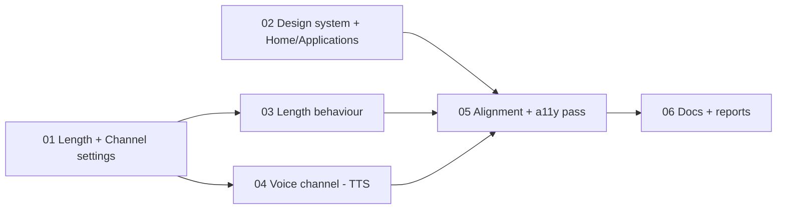

# Tickets: Length, Voice channel, aligned design

Spec: `../spec.md`. Run as a graph: start every ticket whose blockers are all `done`; never wait on a ticket you don't depend on.

| # | Ticket | Blocked by | Status |
|---|---|---|---|
| 01 | Length + Channel settings | — | done |
| 02 | Design system + Home/Applications | — | done |
| 03 | Length behaviour | 01 | done |
| 04 | Voice channel (TTS) | 01 | done |
| 05 | Alignment + accessibility pass on all pages | 02, 03, 04 | done |
| 06 | Docs + reports | 05 | done |
