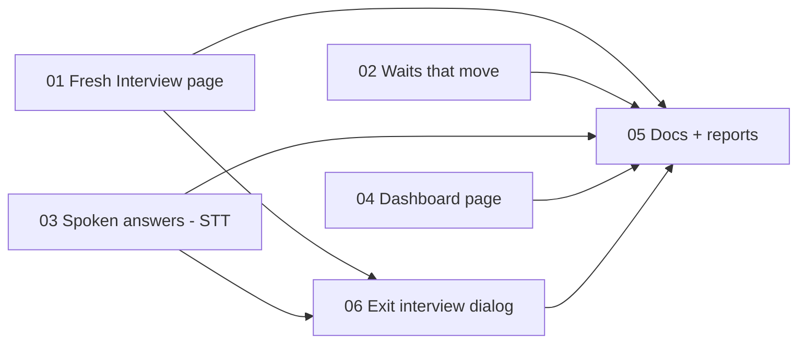

# Tickets: spoken answers, waits that move, a fresh Interview page, Dashboard

Spec: `../spec.md`. Run as a graph: start every ticket whose blockers are all `done`; never wait on a ticket you don't depend on. Tickets 01–03 edit different blocks of the Interview page, so they run in parallel and are rebased as they merge.

| # | Ticket | Blocked by | Status |
|---|---|---|---|
| 01 | Fresh Interview page | — | done |
| 02 | Waits that move | — | done |
| 03 | Spoken answers (STT) | — | done |
| 04 | Dashboard page | — | done |
| 05 | Docs + reports | 01, 02, 03, 04, 06 | done |
| 06 | Exit interview dialog (owner request) | 01, 03 | done |
