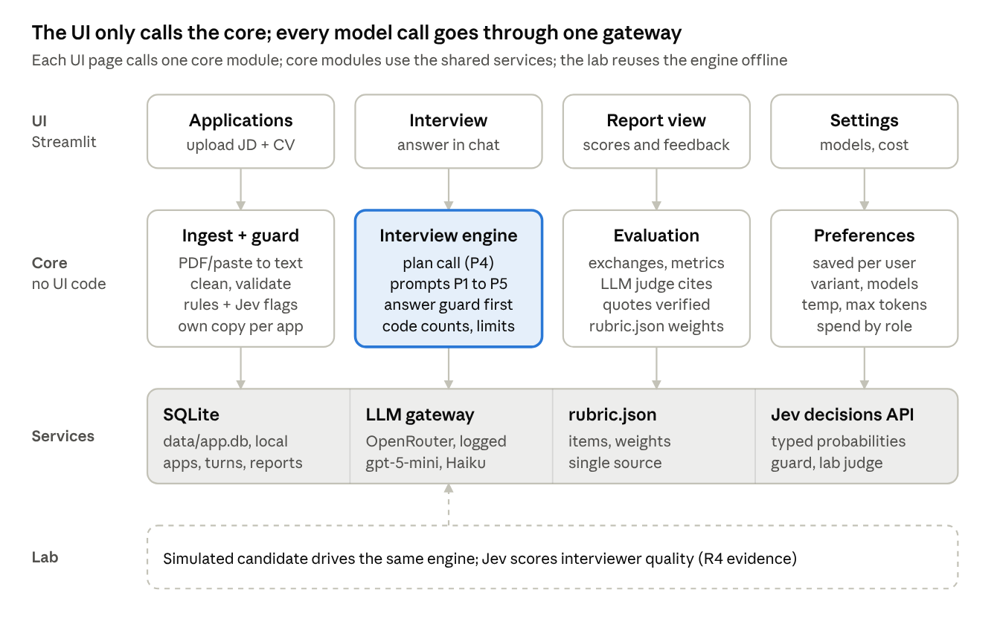
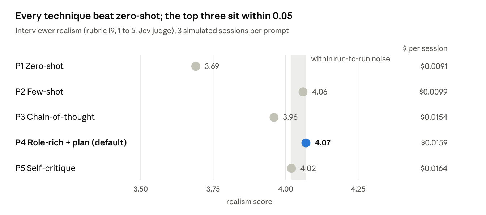

# Interview Helper — Project Report

2 October 2026 · Jinho · [Live version (Claude Docs)](https://claude.ai/code/artifact/cde878a6-a389-40ac-a2d5-710e4ed8578b)

## Executive summary

The project is feature-complete for grading one week ahead of the Friday 9 October review: every mandatory requirement and well over the bonus threshold of optional tasks are built, tested and merged.

- **What it is:** a local Streamlit app that rehearses an interview for **one specific job application**. The user uploads a job description and CV (cover letter optional); an LLM interviewer grounded in those documents runs a realistic multi-turn interview; an LLM judge then scores the transcript against a weighted rubric and writes evidence-backed feedback.
- **Status against the grading scheme:** all five mandatory requirements (R1–R5) met; 13 optional tasks delivered (E3, E4, E7, E8, M1, M2, M3, M6, M7, M9, H1, H4, H5) against a bonus threshold of 2 medium and 1 hard.
- **Delivery:** 18 pull requests merged through CI, 248 automated tests, no open branches except the deliberately parked MFA work.
- **Evidence:** live runs on real models show about 25 s to start an interview, about 3 s per interviewer turn, about $0.015 per interview and $0.03 per report. A 15-session prompt comparison cost $0.52.
- **Honest caveats:** judge scores vary by several points between runs; the prompt comparison is small (one session per persona) and cannot separate the three best prompts; question stacking is reduced, not eliminated.

**Recommendation:** freeze features for grading now. Spend the remaining days on review rehearsal and one end-to-end run with real documents, then resume the secondary roadmap after the review.

## Project context and objectives

The project serves two goals at once: pass the Sprint 1 capstone review with full marks, and leave the owner with a tool worth using for real job applications afterwards.

**The course brief** (Turing College AE, Sprint 1, *Build an Interview Practice App*) asks for a single-page app built with Streamlit or Next.js that calls the OpenRouter API, uses at least five system prompts built with different prompting techniques, and has at least one security guard. The focus of the practice is left to the learner. Full marks require at least two medium and one hard optional task. The review itself is a conversation: the learner must explain prompting techniques, model settings, message roles, output types, the app's weaknesses and possible improvements.

**The owner's goal** is interview practice that is specific to an application, not generic question drills. Every question should come from the actual job description and CV, probe the gaps between them, and end in feedback that says what to fix before the real interview. The app must remain useful after submission, so it was built to a "clean, tested, readable" standard rather than as a throwaway demo.

**Success criteria** agreed at the start:

1. The core flow works end to end: upload JD + CV (cover letter optional) → tailored interview → feedback.
2. Every graded requirement is met and can be pointed to in the code.
3. The owner can explain every design choice at the review, with evidence.
4. Personal data never leaves the owner's machine except as model calls, and never reaches the public repository.

**Constraints:** about one week of build time (review Friday 2026-10-09, hard deadline Monday 2026-10-12); a single local user; OpenRouter as the model provider, subject to the account's guardrail; the repository is public.

## Scope and priorities

Scope was set in two passes: a broad design from the owner's brainstorm, then a re-prioritisation on day one to put the grading criteria and the core flow first and move everything else behind them.

| Area | Status | Why |
| --- | --- | --- |
| Application upload (JD + CV required, cover letter and company notes optional; PDF or paste) | Delivered | Core concept of the app |
| Grounded multi-turn interview with personas, difficulty and limits | Delivered | Core concept; H1, E4, E7 |
| Five interviewer prompt variants and a comparison harness | Delivered | Mandatory R4; H5, E8 |
| Security guards (limits, injection detection, spotlighting) | Delivered | Mandatory R5; E3 |
| Rubric-based feedback report with LLM-as-a-judge | Delivered | Core concept; M2, H5 |
| Settings page: model picker, all model settings, cost, developer separation | Delivered | M1, M3, M7, M9, H4 |
| Login with MFA (password + authenticator app) | Parked, specified as tests (draft PR #4) | Not graded; local single-user app |
| History, progress dashboard | Deferred | Not graded; valuable for long-term use |
| Live per-answer scoring (Jev) and Coaching mode | Deferred | Not graded; Jev already used for the guard and the lab judge |
| Interviewer avatars (image generation, M8) | Deferred | Bonus already exceeded |
| Voice (speech-to-text, text-to-speech) | Deferred | Highest effort and risk for a demo |
| JD import from URL | Deferred | Fragile (sites block scraping); paste covers it |

Two items in the original brainstorm were changed rather than deferred. **Flask + HTML/CSS** became Streamlit, because the brief requires Streamlit or Next.js and the reviewer checks it. **Supabase** became local SQLite, because the app has one user on one machine and real CVs should stay local.

## System architecture

The app has three layers: a thin Streamlit UI, a Python core that holds all logic and imports no UI code, and shared services. Every model call passes through one logged gateway.

**How a session flows.** The Applications page turns PDFs or pasted text into clean documents, flags anything that looks like an instruction to an AI, and stores one copy per application. Starting an interview snapshots those documents, makes a plan (for P4), and asks for the opening turn. Each answer passes the length and injection guards before the engine builds the messages; code counts questions and follow-ups and decides the phase, and the model writes the next turn as validated JSON. When the interview ends, code splits the transcript into exchanges and computes metrics, one judge call scores it with cited evidence, and code turns the scores into the report using the weights in `rubric.json`.

**Why this shape.** The core can be tested without a browser, so most of the 248 tests run on plain functions with scripted model replies. The single gateway means every call's tokens, cost and latency are logged in one place, which powers the cost display and keeps provider changes to one setting.

## Technology stack

The stack is deliberately small: one language, one UI library, one database file, and one HTTP gateway to every model, so that each piece can be explained in a sentence at the review.

| Layer | Choice | Why this, not the alternative |
| --- | --- | --- |
| Language and tooling | Python 3.12, uv, ruff, pytest | One language end to end; uv gives a locked, reproducible environment |
| User interface | Streamlit (multi-page, `st.navigation`) | Required by the brief (or Next.js); fastest path to a working chat UI |
| Core logic | Plain Python package `interview_app`, no UI imports | Testable without a browser; the UI could be replaced later |
| Data models and validation | pydantic, pydantic-settings | Every model response and every setting is validated against a typed schema |
| Storage | SQLite via SQLModel | Single user, local data; moving to Postgres later is a connection-string change |
| Model access | OpenAI Python SDK pointed at OpenRouter | One OpenAI-compatible client reaches any provider; OpenRouter reports the real cost of each call |
| Decision model | Jev (`typesafe/jev-1.13`) via the OpenRouter Decisions API | Returns probabilities instead of text: fast (~0.4 s), stable and cheap; used where a typed yes/no or score is enough |
| Prompt templates | Jinja2 files in `prompts/` | Prompts are readable documents, versioned and reviewed like code |
| Document ingest | pypdf | Extracts PDF text; the user corrects it before saving |
| Delivery | GitHub, git worktrees, pull requests, GitHub Actions CI | Every change reviewed and tested before it reaches `main` |

**Models in use** (all configurable on the Settings page):

| Role | Default model | Reason |
| --- | --- | --- |
| Interviewer and planner | `openai/gpt-5-mini` | The brief's recommended default |
| Final judge | `anthropic/claude-haiku-4.5` | A different model family from the interviewer, which avoids self-preference bias |
| Simulated candidate (lab only) | `google/gemini-2.5-flash` | A third family, so neither side grades its own style |
| Injection guard, lab judge | Jev | Typed probabilities; code sets the threshold |
| Open-weight options (H4) | `google/gemma-4-31b-it`, `minimax/minimax-m2.7` | Passed a live check against the account's guardrail |

The account's OpenRouter guardrail blocks `openai/gpt-5`, DeepSeek and `z-ai/glm-5.2`; each picker entry was confirmed with a real call.

## Key decisions

One principle runs through every decision below: **the model judges, code computes.** Models decide what to ask and how good an answer is; code counts, weighs, enforces limits and makes the final call on thresholds. That split is what makes the app testable and its scores traceable.

| Decision | Alternatives considered | Rationale | Consequence |
| --- | --- | --- | --- |
| Grading criteria and core flow first; extras after the review | Build everything before Friday | The extras are not graded; each one adds explanation burden at the review | Graded scope finished on day one; MFA, voice and dashboard deferred |
| Core package without Streamlit, UI as a thin layer | Logic inside the Streamlit pages | Tests run without a browser; the UI is replaceable | 248 tests, most of them on pure functions |
| One OpenAI-compatible gateway for all chat models | LiteLLM; LangChain | Fewest moving parts; raw API parameters stay visible for the review | Switching provider = a base URL and a key; every call logged with tokens, cost and latency |
| Each of the five prompts = the zero-shot baseline plus exactly one technique | Five independently written prompts | A comparison then isolates what each technique adds | Clean R4 story; only P4 receives the separately generated plan |
| Structured JSON for every interviewer turn, no streaming | Stream plain text | The app needs stage, question id and end-of-interview metadata reliably | 2–5 s spinner per turn instead of streamed words |
| Reasoning fields placed before the message in the JSON | Reasoning after, or no reasoning field | Models write JSON top to bottom, so the model must think or critique before it asks | This ordering is what makes P3 chain-of-thought and P5 self-critique |
| Live status in a trailing system message | Rebuild the whole prompt each turn | The long system prompt stays identical between turns, so the provider can cache it | Cheaper, faster turns |
| Code enforces limits (turns, spend) and the closing rules | Trust the prompt | A prompt can be ignored; code cannot | Interviews always close; the candidate is always invited to ask questions |
| Injection guard = regex rules, then Jev; documents flagged, answers blocked | LLM classifier only | Rules are free and explainable; Jev catches paraphrases in ~0.4 s | Reworded attack blocked at p = 0.99 in a live test; benign "system prompt" answer passed at p = 0.02 |
| One judge call per session, from a different model family | One call per exchange; same model as the interviewer | ~50 s instead of minutes; avoids self-preference bias | Score variance between runs remains (see Risks) |
| Judge must quote the candidate; code verifies the quote | Trust cited turn ids | A real run credited CV facts never said in the interview | Requirement credit and strengths are now grounded in the transcript |
| Local SQLite, single local user, MFA parked | Supabase; full login now | Data stays on the owner's machine; login is not graded | `user_id` kept on every table, so accounts can be added without migration |
| Public repository with a privacy-first `.gitignore` | Private repository | Reviewer access without extra setup | Real applications and design screenshots never committed; a fictional sample application ships instead |

## Mapping to the grading scheme

Every mandatory requirement is met, and 13 optional tasks are delivered against a bonus threshold of 2 medium + 1 hard.

**Mandatory requirements**

| ID | Requirement | How it is met | Where |
| --- | --- | --- | --- |
| R1 | Choose the interview-prep focus | Application-specific mock interviews grounded in the JD, CV and optional cover letter, ending in a rubric report | Whole app |
| R2 | Front end with a UI library | Streamlit, four pages: Home, Interview, Applications, Settings | `app/` |
| R3 | Allowed OpenRouter model | Interviewer `openai/gpt-5-mini` by default | `config.py` |
| R4 | Five system prompts, different techniques, compared | Zero-shot, few-shot, chain-of-thought, role-rich + plan, self-critique; compared on 15 simulated sessions | `prompts/`, `lab/`, `docs/05-prompt-comparison.md` |
| R5 | At least one security guard | Limits, regex + Jev injection detection, spotlighting of untrusted text | `security/` |

**Optional tasks delivered**

| Level | Task | Delivered as |
| --- | --- | --- |
| Easy | E3 More security constraints | Input validation, LLM-based (Jev) injection check, flagged documents |
| Easy | E4 Difficulty levels | Friendly / standard / tough, changing persona tone and follow-up depth |
| Easy | E7 AI interviewer personas | Six interviewer personas derived from the interview type |
| Easy | E8 Tune a model setting | Reasoning effort low vs medium, measured: medium doubled latency with no quality gain |
| Medium | M1 All model settings in the UI | Model, temperature, max tokens, reasoning effort, judge model on the Settings page |
| Medium | M2 Two or more JSON formats | Interview plan, interviewer turn (three variants), judge evaluation, stored report |
| Medium | M3 Price of the prompt | Real cost per call from OpenRouter, catalog prices from the models endpoint, spend by role and model |
| Medium | M6 Job description field | The JD is the centre of the app, alongside CV, cover letter and company notes |
| Medium | M7 Choose the LLM | Curated model picker with prices and open-weight badges |
| Medium | M9 Guard + developer settings separated | Developer settings behind a toggle on the Settings page, not in the interview flow |
| Hard | H1 Full chatbot | Persistent multi-turn sessions that survive a browser refresh |
| Hard | H4 Open-source LLMs | Gemma 4 31B and MiniMax M2.7 in the picker, tested live |
| Hard | H5 LLM-as-a-judge | Candidate report (Claude Haiku) and interviewer-quality judge (Jev) |

Not attempted, by choice: E1, E2, E5, E6 (partly covered by the rubric), M4, M5 (a red-team table exists in the tests but not as a spreadsheet), M8 and H2, H3.

**Evaluation criteria and the evidence for each**

| Criterion | Evidence to show at the review |
| --- | --- |
| Explains prompting techniques | The five-variant table and why each adds exactly one technique |
| Understands model settings | Temperature 0 for the judge; reasoning effort measured (E8); max tokens and truncation |
| Understands system / user / assistant roles | How a turn's messages are assembled, including the trailing status message |
| Understands output types | Structured JSON with schemas, Jev's typed probabilities, free text inside fields |
| Project works as intended | Live demo with the sample application or a real one |
| Correct OpenRouter calls | One gateway, call log with tokens, cost and latency |
| Uses a front-end library | Streamlit multi-page app |
| Justifies technique and parameter choices | Lab results and the reasoning-effort sweep |
| Understands potential problems | Judge variance, small comparison sample, partial rubric, latency |
| Suggests improvements | Median-of-3 judging, larger evaluation set, live scoring, history |

## Delivery process and quality

The project was run like a small engineering team: every change went through its own branch, a pull request and automated checks before it reached `main`.

**Workflow.** Each change lives in its own git worktree (`.worktrees/<branch>`), is committed in small Conventional-Commit steps, pushed, and opened as a pull request with a summary and a test plan. GitHub Actions runs lint, format and the unit tests; the PR is squash-merged only when that is green, then the branch and worktree are removed. 18 PRs were merged this way; one (MFA) is parked as a draft.

**Parallel work.** Independent modules were built by sub-agents in separate worktrees while the interview engine and evaluation, the parts the owner must explain, were built in the main line. Every sub-agent PR was reviewed, rebased and merged by the lead; two real bugs were caught in review (pricing retried the network on every lookup when offline; UI tests leaked a cached database between tests).

**Testing strategy.**

- **Unit tests** cover the pure logic: progress counting, phase decisions, limit enforcement, rubric aggregation (including a hand-computed example), quote verification, guard rules and prompt rendering. None touch the network; model calls are replaced by scripted fakes.
- **UI tests** run the real Streamlit pages headless against a temporary database: create an application, start an interview, answer, end it and render the report.
- **Live tests** (marked `live`, run locally only) call the real APIs with tiny prompts to confirm costs, JSON output from open-weight models and the Jev guard.
- **Live end-to-end runs** were done before each major merge and are recorded in the PR descriptions.

**Rules of the house** are written in `CLAUDE.md`: the core never imports Streamlit, all model calls go through one gateway and are logged, `rubric.json` is the single source of truth for scoring, untrusted text is always wrapped as data, and the public repository never receives personal data.

## Evidence and results

The app was measured on real models, not only unit-tested, and the measurements changed three design choices.

**Prompt comparison (R4).** Each of the five prompts interviewed a simulated candidate (Gemini 2.5 Flash playing a strong, a weak and an evasive persona from the fictional sample CV), and Jev judged each transcript on the interviewer-quality items of rubric §12.

*Source: `lab/compare_prompts.py`, first run, 2026-10-02 · 5 prompts × 3 personas × 1 session.*

Zero-shot is clearly the least realistic; P2, P4 and P5 cannot be separated at this sample size. All five passed the safety gate: no fabrication, coaching, illegal questions or role breaks. P4 stays the default for its structure (guideline + requirement plan), P2 is the cheaper alternative. A second run did not reproduce P4's apparently adaptive follow-ups, so that early claim was withdrawn.

**Live operating figures** (gpt-5-mini interviewer, sample application):

| Measure | Value |
| --- | --- |
| Start an interview (planning call + opening) | about 25 s |
| Interviewer turn | about 3 s |
| Cost of a 5-answer interview | $0.015 |
| Feedback report (Claude Haiku judge) | about 52 s, about $0.03 |
| Jev injection check | about 0.4 s per answer |
| Full prompt comparison + setting sweep | $0.52 |

**Issues found by measuring, and fixed:**

1. **Slow start.** The planning call took 36 s at medium reasoning effort; at low it took 21 s for the same plan structure at half the cost. Planner moved to low.
2. **Judge credited the CV, not the interview.** On a real transcript the judge marked requirements as "convincingly demonstrated" that were never discussed. Fix: the judge must quote the candidate, and code checks the quote against the cited turns.
3. **Question stacking.** Every prompt packed several sub-questions into a turn. A sharper shared rule made turns 20–28% shorter; stacking still occurs at least once per session.
4. **Reasoning effort (E8).** Medium instead of low doubled turn latency (2.9 s → 6.0 s) and cost about 50% more with no quality gain, so the interviewer runs at low.

## Risks, limitations and open issues

None of the open issues blocks the review; two (judge variance and the small evaluation sample) are the most likely reviewer questions and should be raised proactively.

| Issue | Impact | Mitigation now | Next step |
| --- | --- | --- | --- |
| Judge score variance: the same transcript scored 56.6 and 71.5 on two runs | High for trust in the score; low for the written feedback | Report states that scores vary; evidence and quotes are verified in code | Median of 3 judge runs (as `rubric.json` suggests), about 3× cost |
| Small evaluation sample (1 session per persona, 1 application) | P2 / P4 / P5 cannot be ranked | Results doc states the limitation; conclusions limited to what the data supports | At least 3 sessions per persona, more applications, a few human-rated transcripts |
| Question stacking still occurs | Less realistic interviews | Shared rule tightened; turns 20–28% shorter | Measure stacking per turn, not per session; consider a code-level check |
| Partial rubric: red-flag checks (N-items) and logistics (S5) not judged | Overall score omits some penalties | Missing weight redistributed transparently | Add N-items as Jev yes/no checks |
| Latency: about 25 s to start, about 50 s for a report | Waiting at two moments | Spinners state the expected wait | Stream the report; cache plans per application |
| Old CV-derived examples remain in git history of the public repo | Minor privacy exposure | Removed from all current files | Owner decision: rewrite history (force-push) or accept |
| `openai/gpt-5` blocked by the account guardrail | The brief's high-capability option unavailable | gpt-5-mini is the recommended default | Optional: allow it in OpenRouter settings |
| Single local user, no login | Not suitable for sharing | Data stays on the owner's machine | Finish MFA (draft PR #4, behaviour already specified as tests) |

## Review preparation

The review is graded on explanation as much as on the build; these are the questions to expect and the one-line answer plus the evidence to show for each.

| Likely question | Answer in one line | Show |
| --- | --- | --- |
| Why this interview focus? | Generic question drills don't prepare you for *this* job; grounding in the JD and CV makes the interviewer ask what this role's interviewers would ask | Sample application → interview opening that quotes the CV |
| What prompting techniques did you use? | Five variants, each the zero-shot baseline plus one technique: few-shot, chain-of-thought, role-rich with a chained plan, self-critique | `prompts/` folder; the variant table |
| Which worked best, and how do you know? | Every technique beat zero-shot; the top three are within noise; P4 is the default for its structure | The realism chart; `docs/05-prompt-comparison.md` |
| What do temperature, max tokens and reasoning effort do? | Randomness; output cap (too low truncates the JSON); thinking before answering, traded against latency and cost | Judge at temperature 0; the E8 sweep (2.9 s → 6.0 s, no gain) |
| System vs user vs assistant? | System = instructions and wrapped documents; user = the candidate's wrapped answer; assistant = earlier interviewer turns; a trailing system message carries live status | `interview/prompting.py` docstring |
| What output types do you use? | Structured JSON validated against schemas, Jev's typed probabilities, free text inside JSON fields | `interview/schemas.py`, `evaluation/schemas.py` |
| How is it secured? | Length/turn/spend limits; regex then Jev injection detection; spotlighting so documents and answers are data, never instructions | Paste "ignore all previous instructions" as an answer, live |
| What are the weaknesses? | Judge variance, small evaluation sample, stacking not fully solved, partial rubric, start-up latency | Risks table |
| What would you improve? | Median-of-3 judging, larger evaluation set, live per-answer scoring, history and progress tracking | Next steps |

**Demo script (about 6 minutes):**

1. Applications → Load sample application; open the JD and CV tabs.
2. Interview → Hiring manager, standard difficulty, 4 main questions → Start.
3. Give one strong answer, one vague answer (watch the ownership or evidence probe), and paste an injection attempt (watch it blocked).
4. End the interview → Get my feedback report; point at a verified quote and the requirements table.
5. Settings → toggle Developer settings; show the model picker with prices and the open-weight badge; show spend by role.

## Next steps

The next step is not more features: it is for the owner to use the app end to end with one real application and rehearse the review, while three small decisions are closed.

**Decisions needed from the owner (this week)**

- [ ] Rewrite git history to remove the old CV-derived examples from the public repo, or accept them as is
- [ ] Allow `openai/gpt-5` in the OpenRouter guardrail (optional)
- [ ] Confirm the order of the post-review roadmap below

**Before the review (Saturday 3 – Thursday 8 October)**

- [ ] Owner runs one full interview and report with a real application (documents stay local) and notes anything confusing
- [ ] Fix only what that run reveals; feature freeze otherwise
- [ ] Optional quality item with a clear review payoff: median-of-3 judging to cut score variance
- [ ] Rehearse the demo script and the question table twice; read `README.md` and `docs/05-prompt-comparison.md` once
- [ ] Submit the repository link and schedule the review

**Review: Friday 9 October** (hard deadline Monday 12 October as buffer)

**After the review, in order of value for long-term use**

1. History and progress dashboard: past interviews, score trend, recurring weak spots
2. Live per-answer scoring with Jev and a Coaching mode (tip after each answer, retry)
3. A larger evaluation set to calibrate the judge and separate P2, P4 and P5
4. Voice: speech-to-text answers and spoken questions
5. Login with MFA (draft PR #4) if the app is ever shared
6. Interviewer avatars and JD import from URL, if still wanted
